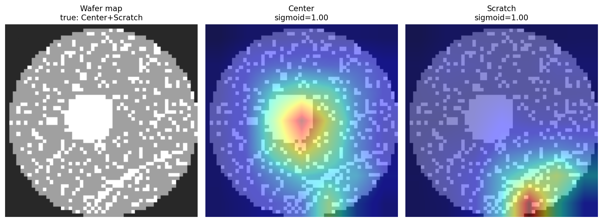
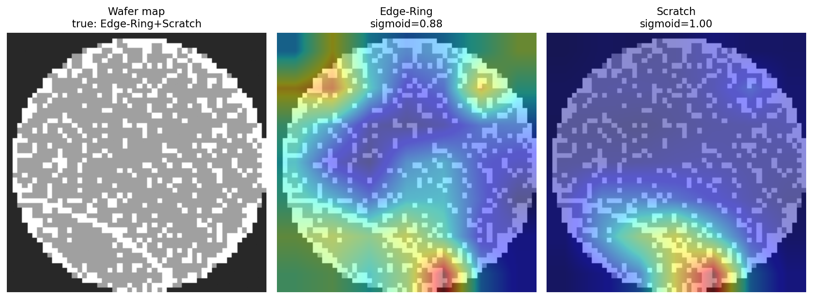

# wafer-mixed

Multi-label robustness study on **MixedWM38** — extending the
[wafer-defect-classifier](https://github.com/ALEX8642/wafer-defect-classifier)
pipeline from single-label WM-811K to *mixed* (superposed) defect patterns,
the production-realistic case. Satellite repo, same pattern as
[wafer-ssl](https://github.com/ALEX8642/wafer-ssl).

**Study complete.** Three findings, each with the honest caveat attached:

| Finding | Number | Caveat |
|---|---|---|
| The WM-811K architecture transfers unchanged to 8-way multi-label | test macro-F1 **0.9846**, exact-match 0.9696 | MixedWM38 is largely GAN-synthesized and saturates fast — this is not a hard ceiling being pushed |
| Pretrained init pays **only** in the low-data regime | **+8.8 macro-F1 pts** at 1 % data (supervised WM-811K init, every seed); exact-match 0.63 → 0.89 | at ≥10 % data all three inits are a wash — a null result, reported as one |
| Per-label thresholds beat global 0.5 where it counts | **−36 % label-level escapes**, cost-weighted error −35 % at 10:1 | temperature scaling itself was a null result (model already near-calibrated, mean ECE 0.0045) |

Session-by-session log with full tables: [STATUS.md](STATUS.md).

## Data

MixedWM38 ([Wang et al. 2020](https://github.com/Junliangwangdhu/WaferMap)):
38,015 wafer maps, 52×52, 38 pattern types that decompose into **8 basic
defect labels** → framed as 8-way multi-label classification (multi-hot
targets, BCE-with-logits), not 38-way multi-class. Dataset facts were
verified locally rather than assumed — the label ordering is undocumented
upstream and was established visually; a stray pixel value and two labels
that never appear in mixes are documented in
[docs/DATA.md](docs/DATA.md) along with frequency tables and sample grids.

**Data boundary:** this repo uses only the public MixedWM38 dataset — no
proprietary or employer data appears here, in any branch, at any point.

## Baseline — multi-label ResNet-18+CBAM (Phase 1)

Ported verbatim from the main repo (8-logit head, D4 dihedral augmentation,
AMP, early stop on val macro-F1). Test set, sigmoid @ 0.5:

| label | precision | recall | F1 | support |
|---|---|---|---|---|
| Center | 1.0000 | 0.9996 | 0.9998 | 2600 |
| Donut | 1.0000 | 1.0000 | 1.0000 | 2400 |
| Edge-Loc | 0.9984 | 0.9769 | 0.9876 | 2600 |
| Edge-Ring | 0.9925 | 0.9967 | 0.9946 | 2400 |
| Loc | 0.9994 | 0.9778 | 0.9885 | 3600 |
| Near-full | 0.9643 | 0.9000 | 0.9310 | 30 |
| Scratch | 0.9984 | 0.9805 | 0.9894 | 3800 |
| Random | 0.9828 | 0.9884 | 0.9856 | 173 |

Macro-F1 **0.9846**, exact-match (all 8 labels correct) **0.9696**.
Near-full and Random ride on small test support (30 / 173) and never appear
in mixes — their numbers carry wide intervals.

The multi-label analogue of a confusion matrix is the **spurious-activation
matrix** S[i,j] = P(predict j | i true, j absent). At convergence it is
nearly empty — the worst cell is Edge-Loc → +Edge-Ring at 0.007:


## Transfer study (Phase 2)

Does pretraining on WM-811K help MixedWM38? Three inits — from scratch,
WM-811K supervised backbone, WM-811K SimCLR backbone
([wafer-ssl](https://github.com/ALEX8642/wafer-ssl)) — swept across
100 % / 10 % / 1 % of the train split, stratified so all arms of a cell
train on identical maps. Test macro-F1, mean over seeds:

| train maps | scratch | supervised | simclr |
|---|---|---|---|
| 266 (1 %) | 0.877 | **0.965** | 0.885 |
| 2,661 (10 %) | 0.980 | 0.978 | 0.981 |
| 26,610 (100 %) | 0.985 | 0.985 | 0.982 |


Transfer pays only when data is scarce; at ≥10 % initialisation stops
mattering. SimCLR's 1 % wash traces to a single rare label (Near-full)
collapsing on 2 of 3 seeds. Full narrative, seed spreads, exact-match
tables, and the budget-scaling gotcha: [docs/TRANSFER.md](docs/TRANSFER.md).

## Calibration + per-label thresholds (Phase 3)

Per-label temperature scaling (multi-label makes calibration per-logit — 8
independent scalars) plus per-label decision thresholds tuned on val, ties
broken toward the lower τ because escapes cost 10× false alarms:

| | raw @0.5 | calibrated @τ |
|---|---|---|
| macro-F1 | 0.9846 | 0.9825 |
| exact-match | 0.9696 | **0.9755** |
| escapes (label-level) | 228 | **145** (−36 %) |
| false alarms | 34 | 64 |
| clean escapes (wafer-level) | 10 | **3** |
| cost-weighted error (10:1) | 0.3044 | **0.1991** (−35 %) |

Temperature scaling alone is a null result — the model is already
near-calibrated (mean ECE 0.0045 → 0.0043). The thresholds are where the
value is: every tuned τ landed below 0.5, trading 30 extra false alarms for
83 fewer escapes. Mixed maps also change the escape bookkeeping: escapes
are naturally per-*label* (a missed Scratch on an Edge-Ring+Scratch map
loses the root-cause signature even though the wafer is still flagged),
while the per-wafer "clean escape" — a defective map predicted fully
normal, the wafer that ships — drops 10 → 3 of 7,403 defective test maps.


**Note on `thresholds.json`:** the tuned τ apply to *temperature-scaled*
probabilities, so the file embeds the per-label T alongside the thresholds —
apply both or neither.

## Grad-CAM++ on mixed patterns

Does attention separate superposed signatures? Mostly yes: on a three-way
Center+Edge-Loc+Scratch mix the per-label heatmaps are fully disjoint
(all at sigmoid 1.00). Edge-Ring+Scratch is partial — Edge-Ring heat spreads
along the rim but shares the scratch region. Edge-Loc+Loc is the weakest
pair, defensibly: a Loc cluster near the edge *is* Edge-Loc-like.


<p align="center">
  
  
</p>

## Quickstart

```bash
pip install -e . -r requirements.txt
python scripts/download_data.py          # ~412 MB download + verify + write splits
pytest                                   # includes split-leakage checks

python -m wafer_mixed.train              # early-stops (14 epochs on the reference 5090 run)
python -m wafer_mixed.evaluate           # metrics tables + spurious matrix → outputs/
python -m wafer_mixed.calibrate          # per-label T + τ → outputs/{calibration,thresholds}.json
python -m wafer_mixed.explain            # Grad-CAM++ overlays → outputs/grad_cam/

python scripts/transfer_study.py         # Phase 2 sweep, 21 runs (~2 h on a 5090; resumable)
python scripts/plot_transfer.py          # assets/transfer_curves.png
```

The transfer study expects donor checkpoints at sibling-repo paths (see
`ARMS` in `scripts/transfer_study.py`); everything else is self-contained.

## Related repos

- [wafer-defect-classifier](https://github.com/ALEX8642/wafer-defect-classifier) —
  the parent pipeline: 9-class WM-811K, focal+CBAM, calibration,
  cost-of-quality framing. Its supervised checkpoint is the transfer donor here.
- [wafer-ssl](https://github.com/ALEX8642/wafer-ssl) — SimCLR pretraining on
  638k unlabeled WM-811K maps; its backbone export is the second donor arm.

## Limitations

- **MixedWM38 is largely GAN-synthesized** and near-uniform by design; models
  saturate quickly (0.93 val macro-F1 after one epoch). Absolute numbers here
  measure pipeline correctness more than real-world difficulty.
- **Near-full (n=30) and Random (n=173)** have small test support and never
  appear in mixed patterns; their per-label metrics carry wide intervals.
- **Full-data runs are single-seed** (42); the data-fraction sweep uses 3
  seeds only where variance is material (1 % and 10 %).

## License

MIT — see [LICENSE](LICENSE).

## References

Wang et al. (2020). MixedWM38 dataset. *IEEE Trans. Semiconductor
Manufacturing*, doi:10.1109/TSM.2020.3020985. Dataset repo:
[github.com/Junliangwangdhu/WaferMap](https://github.com/Junliangwangdhu/WaferMap).

Selvaraju, R. R., et al. (2017). Grad-CAM: Visual Explanations from Deep
Networks via Gradient-based Localization. *ICCV 2017*.
