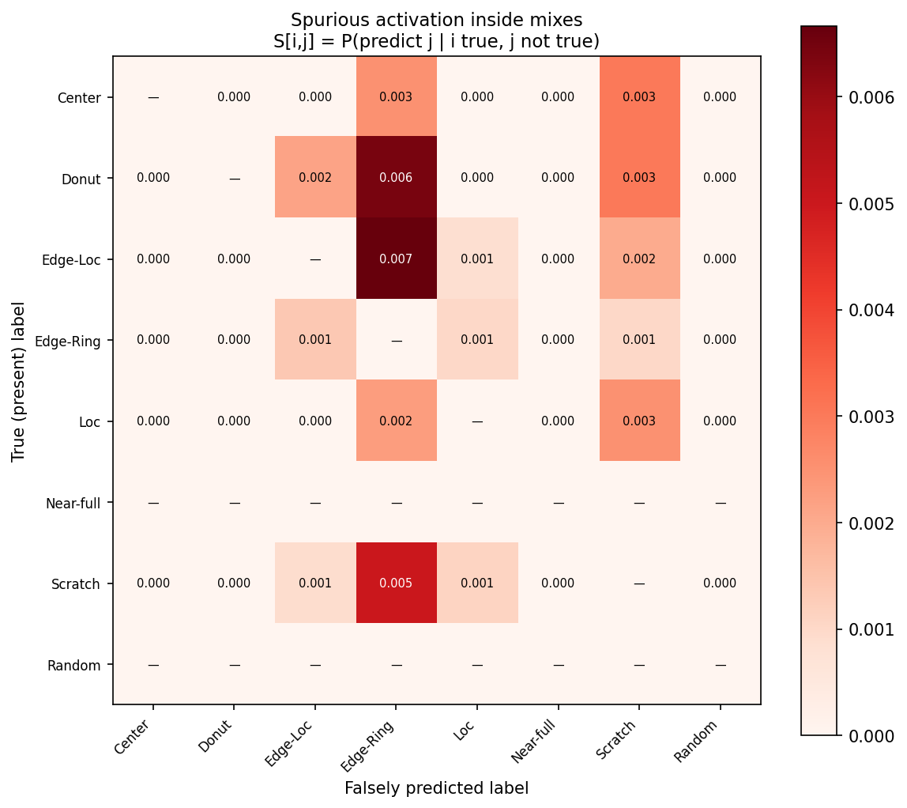
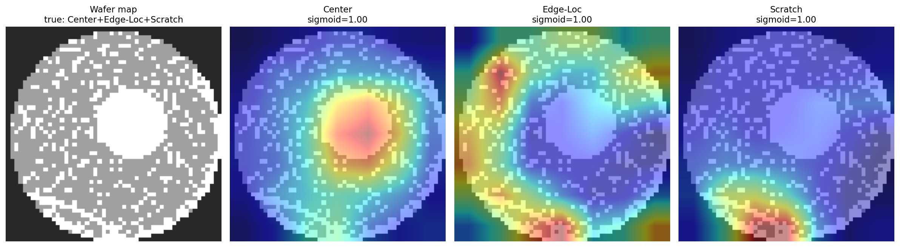
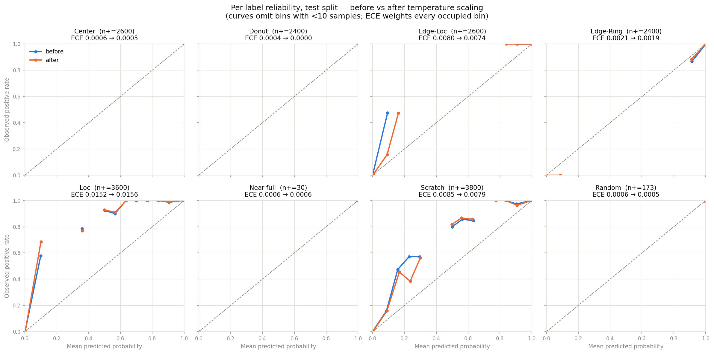

# STATUS — wafer-mixed

Session handoff log. One phase per session (see workspace `PLAN-wafer-mixed.md`).

## Phase 0 — Scaffold + data ✅ (2026-07-01)

**Done:**
- Repo scaffold mirroring `wafer-defect-classifier` (src/wafer_mixed, configs,
  tests, scripts, docs, assets). MIT license, data gitignored.
- `scripts/download_data.py`: auto-downloads MixedWM38 (~412 MB) from the
  authors' Google Drive, SHA256-verifies, checks shapes/combos, writes the
  persisted split.
- `src/wafer_mixed/data.py`: loader yields (3×S×S one-hot tensor, 8-dim
  float multi-hot). Split stratified by full 38-type combination, seed 42,
  persisted to `data/splits.npz` (committed): train 26,610 / val 3,802 /
  test 7,603.
- `scripts/eda.py` → `docs/DATA.md` (frequency tables, sample grids) +
  4 figure grids in `assets/`.
- Tests: 8 passing — encode round-trip, clip, multi-hot correctness, split
  leakage (disjoint + full coverage), stratification (38 combos in every
  split), loader-vs-raw label agreement.

**Dataset facts verified (deviations from the plan's assumptions):**
- 38,015 maps, 52×52, 38 combos, 8-dim multi-hot — all as assumed.
- **Label ordering was undocumented upstream**; verified visually:
  `[Center, Donut, Edge-Loc, Edge-Ring, Loc, Near-full, Scratch, Random]`
  (see docs/DATA.md + assets/singles_grid.png).
- **Pixel values include a stray 3** (214 px / 105 maps) — clipped to 2 in
  `encode_map`, documented in DATA.md.
- **Not GAN-uniform everywhere:** Near-full single has only 149 maps and
  Random single 866; **neither appears in any mix**. Per-label metrics for
  those two will ride on small counts — flag this in Phase 1 analysis.
- One combo (Center+Edge-Loc+Scratch) has 2,000 maps, not 1,000.

**Next (Phase 1, fresh session):** multi-label baseline — port
ResNet-18+CBAM, 8-logit head, BCE-with-logits, D4 augmentation, metrics
module (per-label F1, macro-F1, exact-match, single-vs-mixed breakdown),
train from scratch on 5090.

## Phase 1 — Multi-label baseline 🔨 code done, 5090 run pending (2026-07-01)

**Done (implemented + tested on the 4090 laptop):**
- `model.py`: ResNet-18+CBAM ported verbatim from the main repo; head → 8
  logits (no sigmoid — BCEWithLogitsLoss). `cbam: true` in baseline.yaml.
- `train.py`: BCE-with-logits (no pos_weight — combos near-uniform), AdamW,
  cosine LR, AMP, early stop on val macro-F1@0.5. `backbone_ckpt_path` hook
  ported for Phase 2 (empty = from scratch, the Phase 1 arm).
- `data.py`: D4 augmentation on the train split only (labels are
  D4-invariant, so multi-hot targets unchanged).
- `metrics.py`: per-label F1, macro-F1 (8 labels), exact-match ratio,
  normal/single/mixed subset breakdown, per-label recall by subset, and a
  **spurious-activation matrix** S[i,j] = P(predict j | i true, j absent) —
  the multi-label analogue of a confusion matrix.
  Note: subset macro-F1 averages only labels with support in the subset
  (Near-full/Random never mix; their zero-support F1=0 would distort it).
- `evaluate.py`: full report + per_label_metrics.csv, metrics.json,
  spurious_matrix.png in outputs/.
- Tests: 23 passing (model shapes/CBAM count, hand-computed metrics,
  augmentation one-hot invariance, plus the Phase 0 suite).
- `/code-review` findings applied: decision threshold lives once in
  `metrics.DEFAULT_THRESHOLD`; evaluate restores `input_size` (not just
  arch/cbam) from the checkpoint; first epoch always checkpoints (no stale
  best.pt after a diverged run); `backbone_ckpt_path` anchored to repo root
  like other paths; source-checkpoint `fc.*` keys dropped before backbone
  load (9-class vs 8-logit shape clash); `--pretrained/--no-pretrained`,
  `--cbam/--no-cbam` both directions on CLI.
- Smoke run (1 epoch, 4090): pipeline converges — val macro-F1 0.9473 after
  a single epoch; GAN-synthesized data is learnable fast, expect the full
  run to saturate early. Smoke run already shows Scratch as the dominant
  spurious label inside mixes (Edge-Ring→+Scratch 0.43) — watch whether
  that persists at convergence.

**To run on the 5090 (own terminal, then paste final metrics here):**
```bash
cd wafer-mixed && source ../.venv/bin/activate
python -m wafer_mixed.train                 # batch 128 default, ~30 epochs w/ early stop
python -m wafer_mixed.evaluate              # prints tables; artifacts → outputs/
```
python -m wafer_mixed.train
Device: cuda  |  arch: resnet18  |  cbam: True  |  pretrained: False
Loading data...
  Labels: ['Center', 'Donut', 'Edge-Loc', 'Edge-Ring', 'Loc', 'Near-full', 'Scratch', 'Random']
Loss: BCEWithLogitsLoss (8 independent labels, no pos_weight — rare labels verified learnable without it; see module docstring)
Epoch   1/30  train loss 0.1223 f1 0.8261  |  val loss 0.1344 f1 0.9324 *
Epoch   2/30  train loss 0.0285 f1 0.9748  |  val loss 0.0233 f1 0.9829 *
Epoch   3/30  train loss 0.0258 f1 0.9822  |  val loss 0.0233 f1 0.9762
Epoch   4/30  train loss 0.0183 f1 0.9764  |  val loss 0.0264 f1 0.9811
Epoch   5/30  train loss 0.0171 f1 0.9823  |  val loss 0.0316 f1 0.9691
Epoch   6/30  train loss 0.0143 f1 0.9852  |  val loss 0.0168 f1 0.9855 *
Epoch   7/30  train loss 0.0138 f1 0.9865  |  val loss 0.0169 f1 0.9906 *
Epoch   8/30  train loss 0.0124 f1 0.9811  |  val loss 0.0212 f1 0.9768
Epoch   9/30  train loss 0.0112 f1 0.9869  |  val loss 0.0142 f1 0.9870
Epoch  10/30  train loss 0.0108 f1 0.9903  |  val loss 0.0190 f1 0.9838
Epoch  11/30  train loss 0.0096 f1 0.9885  |  val loss 0.0141 f1 0.9629
Epoch  12/30  train loss 0.0096 f1 0.9894  |  val loss 0.0153 f1 0.9854
Epoch  13/30  train loss 0.0095 f1 0.9867  |  val loss 0.0177 f1 0.9840
Epoch  14/30  train loss 0.0086 f1 0.9880  |  val loss 0.0120 f1 0.9868
Early stop: no val macro-F1 gain for 7 epochs.

Done. Best val macro-F1 (8 labels @0.5): 0.9906
Checkpoint : /home/alex8642/wafer-classifier/wafer-mixed/outputs/best.pt
**Note for Claude in next phase - a bug had to be fixed in src/wafer_mixed/train.py --> all_preds to detach before converting for numpy**

**Metrics table (fill from the 5090 run):**
python -m wafer_mixed.evaluate
Checkpoint : /home/alex8642/wafer-classifier/wafer-mixed/outputs/best.pt  (epoch 7, val macro-F1 0.9906)
Evaluating: 100%|███████████████████████████████████████████████████████████████████████| 60/60 [00:03<00:00, 19.40it/s]

================================================================
TEST SET RESULTS  (multi-label @ sigmoid 0.5)
================================================================
  Macro-F1 (8 labels) : 0.9846  ← headline metric
  Exact-match ratio   : 0.9696  (all 8 labels correct)

  label         prec  recall      f1  support
  Center      1.0000  0.9996  0.9998     2600
  Donut       1.0000  1.0000  1.0000     2400
  Edge-Loc    0.9984  0.9769  0.9876     2600
  Edge-Ring   0.9925  0.9967  0.9946     2400
  Loc         0.9994  0.9778  0.9885     3600
  Near-full   0.9643  0.9000  0.9310       30  (small support)
  Scratch     0.9984  0.9805  0.9894     3800
  Random      0.9828  0.9884  0.9856      173  (small support)

  Subset breakdown (macro-F1 averages only labels with support in the subset):
  subset        n  exact-match   macro-F1
  normal      200       1.0000          —
  single     1403       0.9879     0.9849
  mixed      6000       0.9643     0.9933

  Per-label recall, single vs mixed (— = label never in subset):
  label        single    mixed
  Center       1.0000   0.9996
  Donut        1.0000   1.0000
  Edge-Loc     0.9800   0.9767
  Edge-Ring    0.9950   0.9968
  Loc          0.9700   0.9782
  Near-full    0.9000        —
  Scratch      0.9950   0.9797
  Random       0.9884        —

  Top spurious activations inside mixes (true label → falsely predicted label):
    Edge-Loc → +Edge-Ring: 0.007
    Donut → +Edge-Ring: 0.006
    Scratch → +Edge-Ring: 0.005
    Donut → +Scratch: 0.003
    Center → +Scratch: 0.003
    Loc → +Scratch: 0.003

Per-label CSV : /home/alex8642/wafer-classifier/wafer-mixed/outputs/per_label_metrics.csv
Metrics JSON  : /home/alex8642/wafer-classifier/wafer-mixed/outputs/metrics.json
Spurious matrix: /home/alex8642/wafer-classifier/wafer-mixed/outputs/spurious_matrix.png

**Artifacts pulled from the 5090 (2026-07-02):** `spurious_matrix.png` →
`assets/` (committed, below); `metrics.json` + `per_label_metrics.csv` →
local `outputs/` (gitignored, backing record for the tables above).
`best.pt` stays on the 5090. Standing rule from here on: each phase's
run figures land in `assets/` and get referenced in STATUS.md.



(Polish note for Phase 4: regenerate with 3-decimal annotations — max cell
is 0.007, so 2 decimals reads as all-zeros.)

**Phase 2 donor checkpoints verified on the 5090 (2026-07-02):**
- WM-811K supervised: `wafer-defect-classifier/outputs/best.pt`
  (loader drops `fc.*`; `pretrained_backbone.pt` also present there —
  confirm in Phase 2 which is the WM-811K-trained donor vs ImageNet init)
- wafer-ssl SimCLR: `wafer-ssl/outputs/pretrained_backbone.pt`

**Next (Phase 2, fresh session, after metrics land here):** transfer study —
3 arms (scratch / WM-811K supervised init / wafer-ssl SimCLR init) via
`backbone_ckpt_path`, same budget + seeds, results → docs/TRANSFER.md.

## Phase 2 — Transfer study ✅ (2026-07-02)

**Done (code on this machine, 21-run sweep executed remotely on the 5090):**
- `train_fraction` config + `subsample_indices` in data.py: per-combo
  stratified, deterministic per (fraction, seed), identical subset across
  arms → paired deltas. Plan updated with the data-fraction sweep rationale.
- `load_donor_backbone` factored out of train(); accepts both donor formats
  (`backbone_state_dict` SSL export / `model_state_dict` supervised ckpt,
  fc.* dropped). **Donor facts verified on the 5090:** supervised donor =
  wafer-defect-classifier/outputs/best.pt (134 tensors incl. CBAM,
  key-compatible); the pretrained_backbone.pt sitting in the main repo is
  byte-identical (md5) to wafer-ssl's SimCLR export — not a separate donor.
- `scripts/transfer_study.py`: 3 arms × {1.0, 0.1, 0.01} × seeds
  (42 full; 42/43/44 small), resumable via results.csv, cheapest cells
  first. **Budget bug caught mid-sweep:** patience-7 killed a 1 % scratch
  run at val F1 0.08 (~90 gradient steps total); sub-fraction cells now
  scale epochs ×(1/fraction) capped at 300, patience 30. First sweep's
  partial results were invalidated and the sweep rerun in full.
- `scripts/plot_transfer.py` → assets/transfer_curves.png (curves + min–max
  seed bands). Full narrative + tables in **docs/TRANSFER.md**.
- Sanity check: in-sweep scratch@100 % reproduced Phase 1 exactly
  (0.9846 / 0.9696, stop at epoch 14).
- Tests 38 passing (subsample determinism/coverage/floor, both donor
  formats, arch-mismatch guard, + Grad-CAM suite below).
- /code-review run pre-commit (4 minor findings; shared collect_probs
  helper + one-time test-loader build applied, figure label collision
  checked clear on the real render).

**Headline results (test macro-F1, mean over seeds):**
| train maps | scratch | supervised | simclr |
|---|---|---|---|
| 266 (1 %) | 0.877 | **0.965** | 0.885 |
| 2,661 (10 %) | 0.980 | 0.978 | 0.981 |
| 26,610 (100 %) | 0.985 | 0.985 | 0.982 |

Transfer pays only in the low-data regime: supervised init +8.8 macro-F1
pts at 1 % (every seed), both pretrained arms +27 exact-match pts
(0.63 → 0.89). At ≥10 % initialisation is a wash — the honest null result.
SimCLR's 1 % macro-F1 wash is a verified single-label story: Near-full
(support 30) collapses to F1 0.000 on 2 of 3 seeds while all other labels
stay ≥ 0.91. Full-data supervised exact-match 0.9851 vs 0.9696 (single
seed, suggestive only).

**Phase 3 prep done early (user request):** `src/wafer_mixed/explain.py` —
Grad-CAM/Grad-CAM++ ported to multi-label (sigmoid, per-target-label CAMs,
nested-CBAM-aware target layer) + 7 tests. Smoke on the Phase 1 ckpt:
attention **does** separate superposed signatures (Center+Edge-Loc+Scratch:
three disjoint per-label heatmaps at sigmoid 1.00); Edge-Ring+Scratch
separation is partial — Edge-Ring heat spreads along the rim but shares the
scratch region. 5 figures in local outputs/grad_cam/ (generated on this machine against a
pulled copy of the Phase 1 ckpt; regenerate anywhere with
`python -m wafer_mixed.explain`).

**Run artifacts:** results.csv pulled to local outputs/transfer/ (gitignored
backing record); per-run checkpoints (21 × best.pt) live on the 5090 in
wafer-mixed/outputs/transfer/. assets/transfer_curves.png committed.

**Next (Phase 3, fresh session):** calibration + explainability on mixes —
per-label temperature scaling + thresholds (should also fix the SimCLR-style
rare-label threshold sensitivity), curate Grad-CAM overlay gallery into
assets/ (generator already in place), escapes/false-alarms cost framing per
label. Note for thresholds: metrics.DEFAULT_THRESHOLD is the single source.

## Phase 3 — Calibration + explainability on mixes ✅ (2026-07-02)

**Done (all on this machine — calibration is inference-only, CPU sufficed;
Phase 1 ckpt = the pulled outputs/best.pt):**
- `src/wafer_mixed/calibrate.py`: per-label temperature vector (LBFGS on val
  BCE — multi-label makes calibration per-logit, so T is 8 independent
  scalars), per-label binary ECE (bin by predicted probability, compare to
  observed positive rate), per-label decision thresholds (grid 0.05–0.95 on
  calibrated val probs, maximise per-label F1; ties break toward the LOWER τ
  because escapes cost 10× false alarms), cost analysis, reliability figure.
- Refactor: duplicated restore-cfg-from-checkpoint blocks in evaluate.py /
  explain.py → single `model.load_checkpoint_model`; `collect_probs` is now
  a sigmoid wrapper over new `collect_logits` (calibration needs raw logits).
  `predict_multihot` accepts a per-label threshold vector.
- Tests: 47 passing (9 new — temperature recovery on synthetic 3×-scaled
  logits, hand-computed ECE/cost values, threshold-tuning optima, vector
  thresholds). Numerical gotcha caught on the real run: a perfectly separated
  label (Donut) drives its fitted T toward the 0.05 clamp floor and
  logits/T overflows naive exp — `scipy.special.expit` fixed it.

**Calibration results (T, τ fit on val; ECE on test, 7,603 maps):**

| label | T | ECE before | ECE after | tuned τ |
|---|---|---|---|---|
| Center | 0.961 | 0.0006 | 0.0005 | 0.05 |
| Donut | 0.098 | 0.0004 | 0.0000 | 0.05 |
| Edge-Loc | 1.364 | 0.0080 | 0.0074 | 0.30 |
| Edge-Ring | 1.225 | 0.0021 | 0.0019 | 0.28 |
| Loc | 1.043 | 0.0152 | 0.0156 | 0.08 |
| Near-full | 0.830 | 0.0006 | 0.0006 | 0.11 |
| Scratch | 1.137 | 0.0085 | 0.0079 | 0.41 |
| Random | 0.913 | 0.0006 | 0.0005 | 0.46 |
| **mean** | | **0.0045** | **0.0043** | |

The honest headline: **temperature scaling is a null result here** — the
model is already near-calibrated (mean ECE 0.0045), as expected on
GAN-synthesized data it fits to 0.98 F1. All T ≈ 1 except Donut, where
perfect val separation lets NLL sharpen T toward the clamp floor (harmless —
decisions unchanged). Loc's ECE even ticks up 4e-4: per-label T is fit on
val, no guarantee on test.

**The thresholds are where the value is** (test, raw @0.5 vs calibrated @τ):

| | raw @0.5 | calibrated @τ |
|---|---|---|
| macro-F1 | 0.9846 | 0.9825 |
| exact-match | 0.9696 | **0.9755** |
| escapes (label-level) | 228 | **145** (−36 %) |
| false alarms | 34 | 64 |
| clean escapes (wafer-level) | 10 | **3** |
| cost-weighted error (10:1) | 0.3044 | **0.1991** (−35 %) |

Every tuned τ landed below 0.5 — the model runs under-confident positives
on the hard labels (Loc τ=0.08 cuts its escapes 80→30), so lowering the
bar buys escapes cheaply. The trade is deliberate: 83 fewer escapes for
30 more false alarms and a 0.002 macro-F1 dip.

**Cost framing (mixed maps change the escape bookkeeping):** with superposed
defects the natural escape definition is per-*label*, not per-wafer —
missing Scratch on an Edge-Ring+Scratch map loses the scratch signature for
root-cause even though the wafer is still flagged and routed to review. The
per-wafer analogue ("clean escape": a defective map predicted fully normal,
so nothing flags it at all) is the expensive case — a wafer that ships — and
tuned thresholds cut it 10 → 3 of 7,403 defective test maps. At the
main repo's 10:1 escape:false-alarm costing, per-label thresholds cut
cost-weighted error 35 % versus the fixed 0.5 rule. This also confirms the
Phase 2 hypothesis: the rare-label collapse SimCLR showed at 1 % data was
threshold sensitivity, and per-label τ is the right knob for it.

**Grad-CAM gallery curated → assets/ (5 figures, Grad-CAM++ on the Phase 1
ckpt, all exactly-classified test maps):** attention separates superposed
signatures cleanly on the 3-mix (Center+Edge-Loc+Scratch: three disjoint
heatmaps, all sigmoid 1.00) and on Center+Scratch and Donut+Edge-Loc;
Edge-Ring+Scratch is partial (Edge-Ring heat spreads along the rim but
shares the scratch region); Edge-Loc+Loc is the weakest — both labels put
heat on the same left-rim cluster, defensible physically (a Loc cluster
near the edge *is* Edge-Loc-like) but the least separated pair.




**Run artifacts:** calibration.json + thresholds.json in local outputs/
(gitignored backing record; values reproduced in the tables above). Note the
coupling: the tuned τ apply to temperature-scaled probabilities, so
thresholds.json embeds the per-label T alongside the thresholds.
assets/: reliability_diagram.png + 5 gradcam_*.png committed.

**Next (Phase 4, fresh session):** package.

1. *Phase 1 polish first* (produces a README asset): in evaluate.py's
   `_save_spurious_heatmap`, cell annotations 2 → 3 decimals (max cell is
   0.007 — 2 decimals reads as all-zeros); rerun
   `python -m wafer_mixed.evaluate` locally against outputs/best.pt (CPU
   fine, ~3 min); copy regenerated spurious_matrix.png → assets/.
2. README.md: results tables for all three phases (numbers from this file —
   do not recompute), transfer narrative linking docs/TRANSFER.md, Grad-CAM
   gallery from assets/, quickstart (download_data → train → evaluate →
   calibrate → explain), public-data/zero-IP boundary statement, cross-links
   to wafer-defect-classifier and wafer-ssl.
3. Update main repo README extension section + workspace ROADMAP.md to point
   here.
4. Resume bullet, honest numbers — two equally honest phrasings, pick one:
   macro-F1 version (0.9846 multi-label; transfer +8.8 F1 pts at 1 % data;
   thresholds −36 % escapes at 10:1 costing) or exact-match version
   (0.63 → 0.89 at 1 % data via pretrained init).
5. Verify quickstart on a fresh clone to a temp dir. Caveat: this box is
   CPU-only — smoke `train` with `--num-epochs 1` (or verify download +
   evaluate path only) and say so; full training claims stay on the 5090.
6. Wherever README mentions thresholds.json: the tuned τ apply to
   temperature-scaled probs (the file embeds per-label T for that reason).
7. /code-review pre-commit (inline, no sub-agents), commit, push.

## Phase 4 — Package ✅ (2026-07-02)

**Done:**
- Spurious-matrix polish: `_save_spurious_heatmap` annotations 2 → 3
  decimals; evaluate rerun locally on CPU against outputs/best.pt —
  **reproduced the Phase 1 5090 numbers exactly** (macro-F1 0.9846,
  exact-match 0.9696, same top spurious cells); regenerated
  spurious_matrix.png → assets/ (matrix no longer reads as all-zeros).
- README.md rewritten for the completed study: three-finding summary table
  (each with its honest caveat inline), per-label baseline table, transfer
  table linking docs/TRANSFER.md, calibration/threshold table with the
  thresholds.json coupling note (tuned τ apply to temperature-scaled probs;
  the file embeds per-label T), Grad-CAM gallery, quickstart covering all
  five stages + the transfer sweep, data-boundary statement, limitations
  (GAN saturation, small-support labels, single-seed full-data runs).
  All numbers copied from this file, none recomputed — except the evaluate
  rerun above, which doubled as a reproduction check.
- Cross-links: main repo README "Self-supervised + ensemble extension"
  section → "Extensions" (wafer-ssl paragraph unchanged, wafer-mixed
  paragraph added); workspace ROADMAP.md wafer-mixed moved to Done;
  ALEX8642 profile README wafer-mixed moved from "In progress" into the
  portfolio table. (Main-repo/profile commits are separate, in their repos.)
- **Resume bullet (macro-F1 phrasing chosen):**
  > Extended a wafer-defect CNN pipeline to multi-label classification of
  > mixed defect patterns (MixedWM38, test macro-F1 0.985); a controlled
  > transfer study showed pretrained initialisation pays only when labels
  > are scarce (+8.8 F1 pts at 1 % of training data), and per-label decision
  > thresholds cut defect escapes 36 % at a 10:1 escape:false-alarm cost
  > ratio.
  Why over the exact-match phrasing: it carries all three findings (model,
  transfer rigor, cost-aware operating point) instead of one, the escapes/
  cost-ratio clause speaks directly to manufacturing-quality readers, and
  "0.63 → 0.89 exact-match" needs context a resume line can't provide —
  cold, 0.63 reads as a weak model rather than a scarce-data baseline.
- Fresh-clone quickstart verified end-to-end in a temp dir (this box is
  CPU-only, so `train` was smoked with `--num-epochs 1` per the plan; full
  training claims remain from the 5090 runs): clone → `pip install -e .` →
  download (412 MB, SHA256 + shape/combo checks pass) → 47 tests pass →
  train 1 epoch on CPU (~21 min, val macro-F1 0.9652 — in line with the
  5090's epoch-1 0.9324 and the 4090 smoke's 0.9473) → evaluate → calibrate
  → explain
  (all 5 Grad-CAM figures regenerate). Every quickstart command ran as
  written in the README.

**Next:** project complete — no further phases. Follow-on work happens in
the root-cause / SQL pipeline repo (workspace ROADMAP.md project 2).
