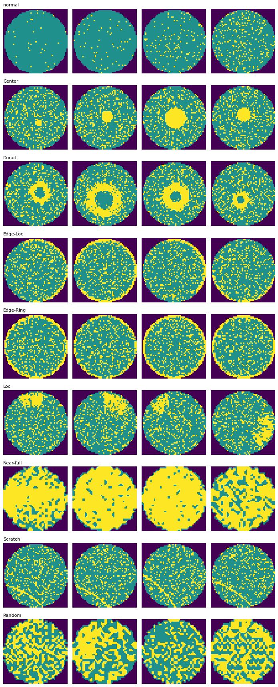
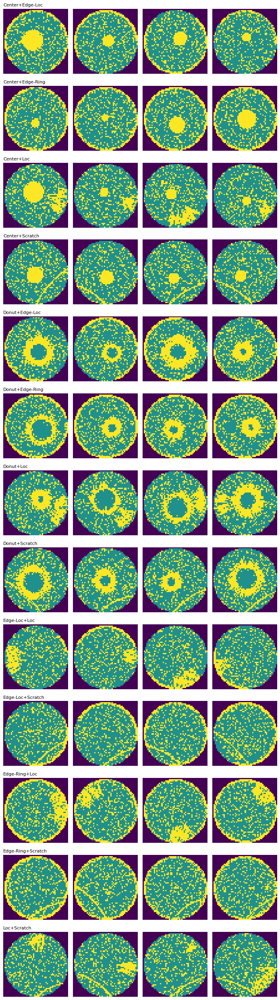
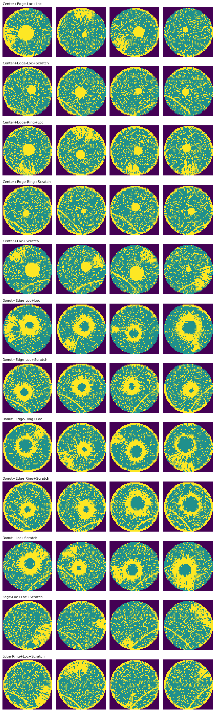
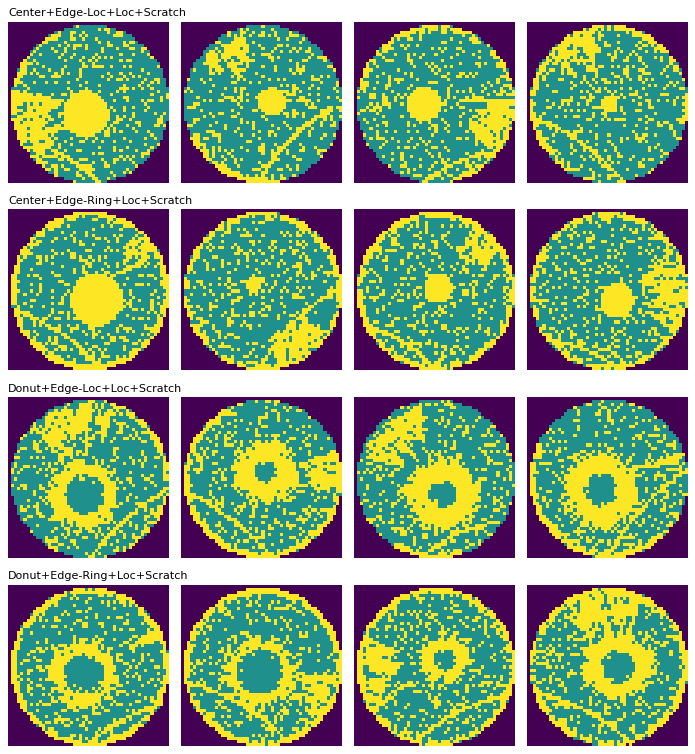

# MixedWM38 — dataset notes (generated by scripts/eda.py)

Source: [Junliangwangdhu/WaferMap](https://github.com/Junliangwangdhu/WaferMap)
(Wang et al. 2020, IEEE TSM, doi:10.1109/TSM.2020.3020985). Mirrors: Kaggle
(`co1d7era/mixedtype-wafer-defect-datasets`), Google Drive (authors' link).
Public dataset — no proprietary or employer data is used anywhere in this repo.

## Verified facts (computed from the local copy)

- **38,015 wafer maps**, 52×52, stored as `arr_0` (int32) in `MixedWM38.npz`.
- Labels `arr_1`: (**38,015, 8) multi-hot** over 8 basic defect types; all-zero
  row = normal wafer. **38 unique combinations** (1 normal + 8 single +
  13 two-mix + 12 three-mix + 4 four-mix).
- Pixel semantics: 0 = outside wafer, 1 = passing die, 2 = failing die —
  same as WM-811K.
- **Deviation from upstream docs:** 214 pixels across 105 maps
  carry the undocumented value 3. `encode_map` clips to [0, 2], so they are
  treated as failing die.
- Upstream states the mixed patterns were partially **GAN-generated** to
  balance combination counts (most combos have exactly 1,000 maps). The two
  irregular counts — Near-full single (149)
  and Random single (866) — echo the
  natural scarcities in WM-811K. Random never appears in any mix.

### Label ordering (verified visually — undocumented upstream)

Upstream README only says the 8 columns are basic types "C2–C9" without
naming the order. The ordering below was confirmed by rendering single-type
samples per column (`assets/singles_grid.png`) and matching the canonical
pattern morphologies:

| Column | Label | Total maps | As single | In mixes |
|---|---|---|---|---|
| 0 | Center | 13,000 | 1,000 | 12,000 |
| 1 | Donut | 12,000 | 1,000 | 11,000 |
| 2 | Edge-Loc | 13,000 | 1,000 | 12,000 |
| 3 | Edge-Ring | 12,000 | 1,000 | 11,000 |
| 4 | Loc | 18,000 | 1,000 | 17,000 |
| 5 | Near-full | 149 | 149 | 0 |
| 6 | Scratch | 19,000 | 1,000 | 18,000 |
| 7 | Random | 866 | 866 | 0 |

## Labels-per-map distribution

| # active labels | 0 (normal) | 1 | 2 | 3 | 4 |
|---|---|---|---|---|---|
| maps | 1,000 | 7,015 | 13,000 | 13,000 | 4,000 |

## Combination frequency (all 38 types)

| Combination | # labels | Maps |
|---|---|---|
| normal | 0 | 1,000 |
| Center | 1 | 1,000 |
| Donut | 1 | 1,000 |
| Edge-Loc | 1 | 1,000 |
| Edge-Ring | 1 | 1,000 |
| Loc | 1 | 1,000 |
| Near-full | 1 | 149 |
| Random | 1 | 866 |
| Scratch | 1 | 1,000 |
| Center+Edge-Loc | 2 | 1,000 |
| Center+Edge-Ring | 2 | 1,000 |
| Center+Loc | 2 | 1,000 |
| Center+Scratch | 2 | 1,000 |
| Donut+Edge-Loc | 2 | 1,000 |
| Donut+Edge-Ring | 2 | 1,000 |
| Donut+Loc | 2 | 1,000 |
| Donut+Scratch | 2 | 1,000 |
| Edge-Loc+Loc | 2 | 1,000 |
| Edge-Loc+Scratch | 2 | 1,000 |
| Edge-Ring+Loc | 2 | 1,000 |
| Edge-Ring+Scratch | 2 | 1,000 |
| Loc+Scratch | 2 | 1,000 |
| Center+Edge-Loc+Loc | 3 | 1,000 |
| Center+Edge-Loc+Scratch | 3 | 2,000 |
| Center+Edge-Ring+Loc | 3 | 1,000 |
| Center+Edge-Ring+Scratch | 3 | 1,000 |
| Center+Loc+Scratch | 3 | 1,000 |
| Donut+Edge-Loc+Loc | 3 | 1,000 |
| Donut+Edge-Loc+Scratch | 3 | 1,000 |
| Donut+Edge-Ring+Loc | 3 | 1,000 |
| Donut+Edge-Ring+Scratch | 3 | 1,000 |
| Donut+Loc+Scratch | 3 | 1,000 |
| Edge-Loc+Loc+Scratch | 3 | 1,000 |
| Edge-Ring+Loc+Scratch | 3 | 1,000 |
| Center+Edge-Loc+Loc+Scratch | 4 | 1,000 |
| Center+Edge-Ring+Loc+Scratch | 4 | 1,000 |
| Donut+Edge-Loc+Loc+Scratch | 4 | 1,000 |
| Donut+Edge-Ring+Loc+Scratch | 4 | 1,000 |

## Sample grids

- Singles + normal: 
- Two-mix: 
- Three-mix: 
- Four-mix: 

## Train/val/test split

Stratified by the full 38-type combination (fixed seed), so every rare mix
appears in all three splits.

| Split | Maps |
|---|---|
| train | 26,610 |
| val | 3,802 |
| test | 7,603 |

All 38 combinations present in every split: **True**.
Indices persisted in `data/splits.npz` (seed 42); regenerated
only if that file is deleted.
