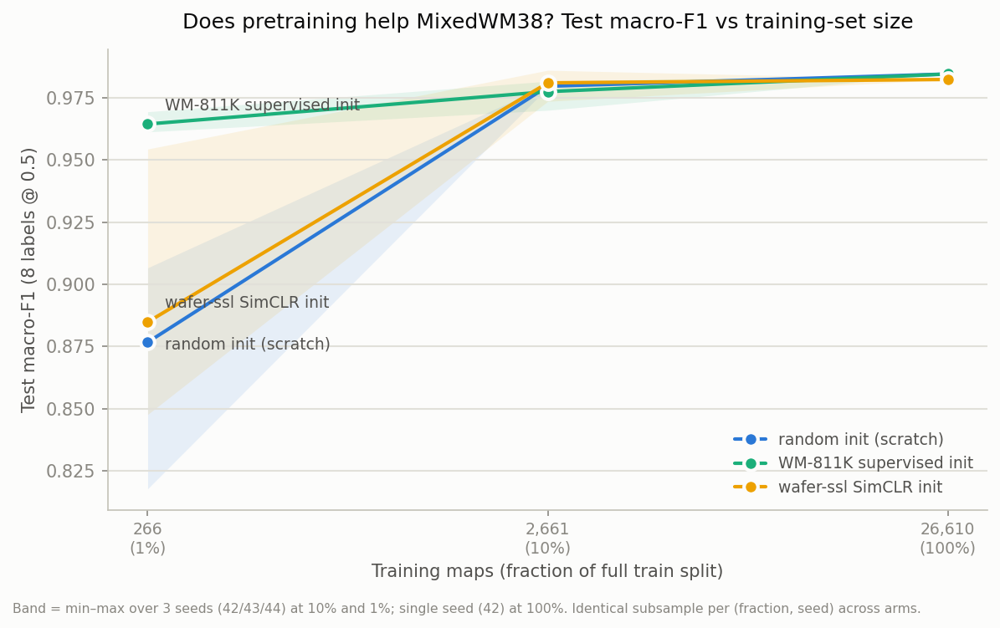

# Transfer study — does WM-811K pretraining help MixedWM38?

Phase 2 of the robustness study: three initialisations for the multi-label
ResNet-18+CBAM, compared across a training-set-size sweep. All runs on the
public MixedWM38 dataset; donors were trained on the public WM-811K dataset
(no proprietary data anywhere in this study).



## Setup

**Arms** (only the initialisation differs):

| arm | initialisation |
|---|---|
| `scratch` | random (the Phase 1 baseline configuration) |
| `supervised` | WM-811K supervised backbone — `wafer-defect-classifier` `outputs/best.pt` (9-class head dropped; CBAM weights transfer) |
| `simclr` | WM-811K SimCLR backbone — `wafer-ssl` `outputs/pretrained_backbone.pt` (headless export) |

**Fractions:** 100 % / 10 % / 1 % of the train split (26,610 / 2,661 / 266
maps), subsampled stratified by the full 38-type combination with a per-seed
RNG, so every combination survives even at 1 % and **all three arms of a
(fraction, seed) cell train on the identical maps** — deltas are paired.
Val (3,802) and test (7,603) splits are never subsampled.

**Seeds:** 42/43/44 at 1 % and 10 %; 42 at 100 % (the full-data regime is
where Phase 1 already showed run-to-run variance is small).

**Budget:** "same epochs" is not "same budget" once the train set shrinks —
30 epochs at 1 % is ~90 gradient steps, and the Phase 1 early-stop rule
(patience 7) fired mid-warm-up (observed: a 1 % scratch run stopped at epoch
10 with val F1 0.08). Sub-fraction cells scale epochs by 1/fraction (capped
at 300) with patience 30, so every run trains to plateau; the 100 % cell
keeps the exact Phase 1 budget for comparability. See
`scripts/transfer_study.py`; full per-run log in `outputs/transfer/results.csv`
(regenerate with `python scripts/transfer_study.py` — resumable, skips
finished cells).

## Results

Test macro-F1 (8 labels @ 0.5), mean over seeds (min–max):

| train maps | scratch | supervised | simclr |
|---|---|---|---|
| 266 (1 %) | 0.877 (0.818–0.907) | **0.965 (0.961–0.969)** | 0.885 (0.848–0.954) |
| 2,661 (10 %) | 0.980 (0.979–0.980) | 0.978 (0.970–0.982) | 0.981 (0.974–0.986) |
| 26,610 (100 %) | 0.985 | 0.985 | 0.982 |

Test exact-match ratio (all 8 labels correct), mean over seeds:

| train maps | scratch | supervised | simclr |
|---|---|---|---|
| 266 (1 %) | 0.628 | **0.895** | **0.891** |
| 2,661 (10 %) | 0.959 | 0.957 | 0.963 |
| 26,610 (100 %) | 0.970 | 0.985 | 0.976 |

## Findings

1. **Transfer pays only when data is scarce.** At 1 % of the training data,
   the WM-811K supervised init gains **+8.8 macro-F1 points** over scratch
   (0.877 → 0.965) and the gain holds on every seed with a tight spread
   (0.961–0.969 vs scratch's 0.818–0.907). At 10 % and 100 % the arms are
   statistically indistinguishable on macro-F1 — the anticipated null
   result, stated as such: MixedWM38 is learnable from scratch at these
   sizes, so pretraining buys convergence in the low-data regime, not a
   higher ceiling.

2. **Both pretrained inits massively improve exact-match at 1 %** (+27
   points: 0.63 → ~0.89). For a fab, exact-match is the routing-relevant
   number — the full defect combination identified correctly.

3. **SimCLR's macro-F1 at 1 % is a high-variance wash — and the reason is
   one label.** Its mean (0.885) hides a bimodal spread (0.848 / 0.954 /
   0.852). Per-label evaluation of the seed-42 checkpoint shows a total
   collapse on Near-full (F1 0.000, support 30) while every other label
   scores ≥ 0.91: one rare label costs up to 12.5 macro-F1 points. Near-full
   has ~1 training map at 1 %, never appears in mixes, and is the label
   SimCLR pretraining evidently does not prime. The supervised donor — which
   saw Near-full as a class on WM-811K — never drops it.

4. **At full data, supervised init still nudges exact-match** (0.985 vs
   0.970, single seed — suggestive, not claimed as significant; macro-F1 is
   tied at 0.985).

**Practical takeaway:** if a new fab process yields only hundreds of labelled
mixed-defect maps, initialise from a supervised wafer-map backbone — it is
worth ~9 macro-F1 / ~27 exact-match points and is dramatically more stable
across seeds. Once tens of thousands of labels exist, initialisation stops
mattering for this architecture and dataset.

## Reproducing

```bash
python scripts/transfer_study.py        # 21 cells, ~2 h on a 5090; resumable
python scripts/plot_transfer.py         # assets/transfer_curves.png
```

Donor checkpoints are expected at the sibling-repo paths listed in
`scripts/transfer_study.py` (`ARMS`).
